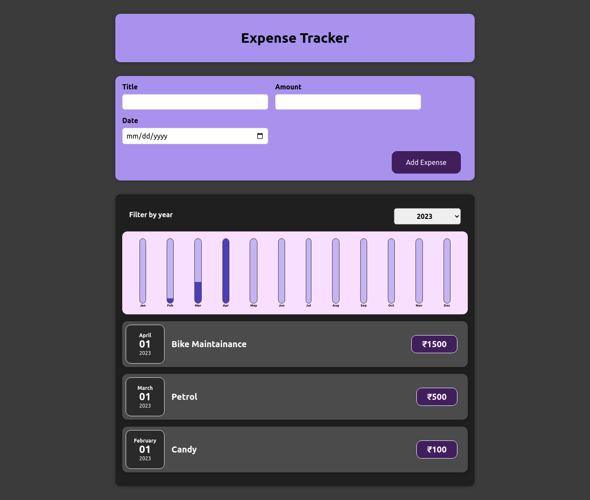

# Expense Tracking App

This is expense tracking app built using Reactjs, a JavaScript front end library for building user interfaces.

## Demo

https://skolap-react-expensetracker.web.app/

## Tech Stack

React, Firebase Hosting

## Features

- Add Expenses
- View Expenses
- Select expenses by year
- View expense chart

## Installation

- clone repo
- `npm install`
- `npm start`

## Authors

- Shailesh Kolap - [skolap](https://github.com/Skolap)

## Screenshots

  
  
 

<!-- 

 -->
